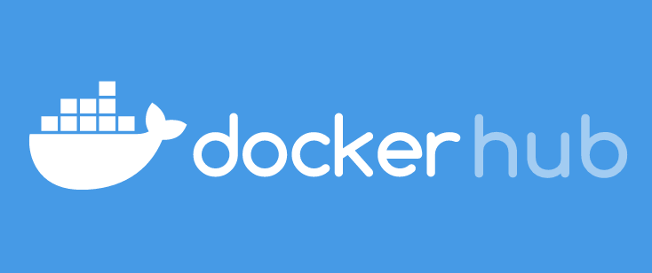
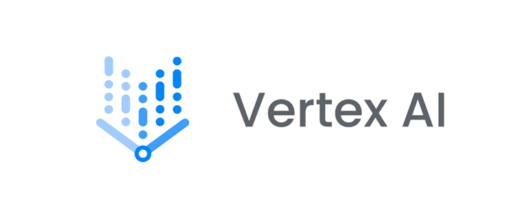

# ModelHub: A More Flexible TorchServe Alternative for Vertex AI

---

<a href="https://hub.docker.com/r/devxpro/model-hub">  </a>
<a href="https://cloud.google.com/vertex-ai" style="float: left"> </a>

This application is also available as a Docker image, which you can find on [Docker Hub](https://hub.docker.com/r/devxpro/model-hub).
This image is fully compatible for use with [Vertex AI](https://cloud.google.com/vertex-ai).

---
**ModelHub** is an elegant, Golang-based alternative to **TorchServe**, offering a swift and flexible service for deploying and managing machine learning models. ModelHub stands out with its advanced metrics, broad compatibility, and seamless integration with **Vertex AI**.

ModelHub is not limited to Torch models; it can be used with any Python-based machine learning models, providing a versatile solution for model deployment and management.
As a killer feature, ModelHub allows you to deploy and use multiple models on Vertex AI, setting it apart from TorchServe. This introduction highlights the significant benefits of using ModelHub for your AI projects.

## Getting Started

To use ModelHub, follow these steps:

#### 1. Prepare your model folder

Place the model folders in the `models` directory of your project.
>If you don't have model files locally and they are part of some Python library, you can skip this step

#### 2. Create a `requirements.txt` file

Since ModelHub can work with more than just PyTorch, list your required dependencies in a `requirements.txt` file. For example:

```
torch==1.13.1
transformers==4.28.1
sentencepiece==0.1.98
protobuf==3.20.1
```

#### 3. Create handler files

Create a handler file for each model or use a single handler for all models. The handler file can be named as desired, but the class must be named Handler. The handler file should include the following two functions:

`load_model`: This function loads the model and sets the model_loaded flag to True.

`predict`: This function should take a single argument, data, which is the input data for the model. The function should return a dictionary with a predictions key and the corresponding model predictions as the value.

```python
class Handler:
    def __init__(self):
        self.model_loaded = False
        self.model = None

    def load_model(self, path):
        # here you can pass the model loading
        # self.model = <assign you model>
        # mandatory notify model loaded
        self.model_loaded = True

    def predict(self, data):
        tests = data['instances']
        labels = data['parameters']['labels']
        # another_param = data['parameters']['another_param']
        predictions = []
        # predictions = self.model.<your prediction method>(tests, labels)
        prediction = {'predictions': predictions}
        return prediction
```
#### 4. Create a YAML configuration file
Create a YAML configuration file specifying the model paths, the number of workers for each model, and the handler path. Here's an example:
```yaml
models:
  model1:
    name: "model1"
    path: "/models/model1"
    handler: "/etc/handler.py"
    workers: 2
  model2:
    name: "model2"
    path: "/models/model2"
    handler: "/etc/handler.py"
    workers: 3
```
#### 5. Create a Dockerfile
Create a Dockerfile that will copy all the necessary files into the container:
```Dockerfile
FROM devxpro/model-hub:latest

# Install your Python requirements for the model
COPY /requirements.txt ./requirements.txt
RUN pip3 install --no-cache-dir -r requirements.txt

ENV SERVER_PORT=8080
ENV CONFIG_PATH=/etc/config.yaml

# WORKERS_LOADING_STRATEGY - sequential/parallel
ENV WORKERS_LOADING_STRATEGY='sequential'

ENV METRICS_DISPLAY_FREQUENCY="30"

COPY ./models /models
COPY ./config.yaml /etc/config.yaml
COPY ./handler.py /etc/handler.py
#OR more handlers
#COPY ./handler2.py /etc/handler2.py
#COPY ./handler3.py /etc/handler3.py
```
To create a Dockerfile for ModelHub, follow these steps:

- Use the `devxpro/model-hub:latest` image as the base.
- Copy the requirements.txt file to the root of the container and run `pip install -r requirements.txt` to install the necessary Python packages for your model.
- Set the following environment variables:

    - `SERVER_PORT`: The port that the ModelHub server listens on. By default, it is set to 8080.
    - `CONFIG_PATH`: The path to the YAML configuration file for ModelHub. By default, it is set to `/etc/config.yaml`.
    - `WORKERS_LOADING_STRATEGY`: The strategy used to load workers. It can be set to either `sequential` or `parallel`. By default, it is set to `sequential`, which loads models one after another to avoid overloading the machine.
    - `METRICS_DISPLAY_FREQUENCY`: Specifies the interval (in seconds) when the CPU, GPU, RAM, and worker-specific metrics are displayed in the logs.

- Copy your models and handler files to the container.

After building the Docker image, you can run it and use ModelHub on any machine, including Vertex AI.
## Example Requests

### POST /predict

```json
{
    "instances": [
        "text1", "text2"
    ],
    "parameters": {
        "model": "model1",
        "labels": [
            "label1", "label2"
        ],
        "param2": "value2",
        "param3": "value3",
      
        "priority": 50,
        "metadata": "Some Metadata"
    }
}
```
`priority` and `metadata` parameters is optional. By default, priority=1.
The higher the priority, the faster the request will be processed. This can be useful in cases where you receive many requests simultaneously on model-hub and need to ensure faster access to workers for more important tasks.
`metadata` is useful in cases where it's necessary to understand from the logs where and how a request is being processed. Metadata can be a string with any content. You will see this string in the logs after the prediction has been successfully made.
> As Vertex AI only supports a single endpoint, it is mandatory to specify the name of the model in the parameters section to indicate which model to use for prediction. This allows you to deploy and manage multiple models using the approach of passing the model name as a parameter.
### POST /ping

Health check endpoint.

